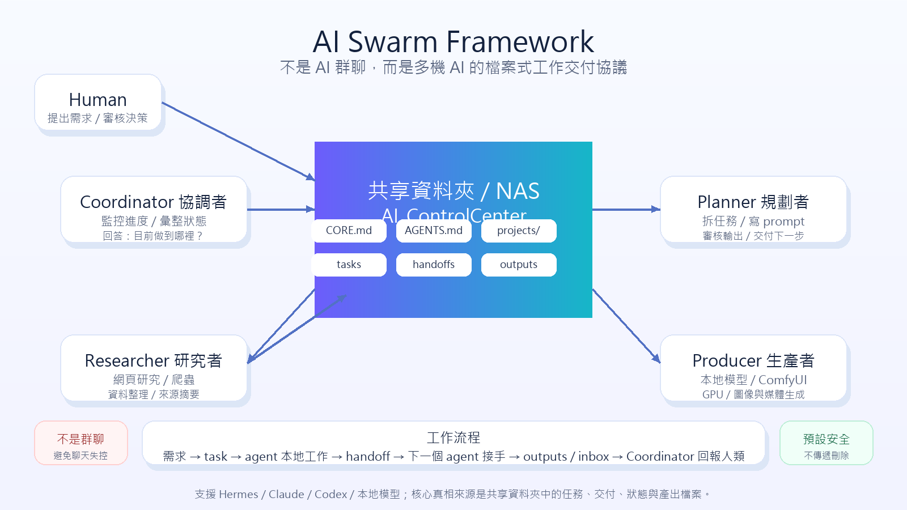

# AI Swarm Framework

版本：0.1.0
授權：MIT

AI Swarm Framework 是一個 local-first、file-based 的多 AI agent 協作框架。



它不是 AI 群聊工具。

它的核心概念是：

> 不讓 agent 用私訊或聊天室當真相來源，而是讓多台機器上的 AI agent 透過共享資料夾 / NAS 中的 task、handoff、status、output 檔案進行協作。

換句話說，這是一套「多機 AI 工作交付協議」。

---

## 這個專案解決什麼問題？

如果你有多台機器，例如：

- 一台 Mac mini 作為協調者
- 一台 Windows 工作站作為規劃者
- 一台 Linux GPU 主機負責本地模型 / ComfyUI / 產圖
- 一台 PC 負責爬蟲 / 資料收集

你可能會遇到這些問題：

- 多個 AI agent 要怎麼知道誰負責什麼？
- A agent 做完後，要怎麼交給 B agent？
- 某台機器離線時，工作狀態會不會消失？
- 要怎麼知道目前進度？
- 要怎麼避免 AI 們在群聊裡自嗨，但沒有可追蹤產出？

AI Swarm Framework 的答案是：

用共享資料夾作為協作事實層。

agent 不需要直接互聊。  
agent 只要讀寫明確的 task / handoff / status / output 檔案。

---

## 核心架構

```text
AI_ControlCenter/
  CORE.md
  AGENTS.md
  projects/
  skills/
  inbox/
  swarm/
    tasks/
      inbox/
      active/
      blocked/
      done/
    handoffs/
      pending/
      accepted/
      done/
    status/
    outputs/
```

各資料夾用途：

- `CORE.md`：團隊最高規則、原則與限制。
- `AGENTS.md`：agent 名單、角色、能力邊界。
- `projects/`：專案真相來源。
- `skills/`：可重複使用的工作流程與技能。
- `inbox/`：agent 產出，等待人類審核。
- `swarm/tasks/`：任務狀態。
- `swarm/handoffs/`：agent 之間的工作交付。
- `swarm/status/`：各 agent / 節點狀態。
- `swarm/outputs/`：任務成果與檔案。

---

## 預設角色

開源版預設使用四個通用角色：

### Coordinator

協調者 / 監控者。

負責：

- 查看任務進度
- 查看 pending handoff
- 彙整各 agent 狀態
- 回報給人類
- 提出分派建議

不應該：

- 自動核准高風險動作
- 自動對外發布
- 自動修改核心治理文件

---

### Planner

規劃者 / 架構者。

負責：

- 拆解任務
- 寫文案與文件
- 設計工作流程
- 產生 prompt
- 審核其他 agent 的輸出

---

### Producer

生產者 / GPU / 本地模型節點。

負責：

- 跑本地模型
- ComfyUI
- 圖像 / 影片 / 渲染
- 大量運算或媒體產出

---

### Researcher

研究者 / 資料收集節點。

負責：

- 網頁研究
- 爬蟲
- 資料整理
- 來源摘要
- 市場 / 競品參考

---

## 為什麼不是 AI 群聊？

AI 群聊看起來直覺，但實務上會有幾個問題：

1. 誰負責什麼不清楚。
2. 聊天紀錄很難當作穩定任務狀態。
3. 某台機器離線時，訊息容易斷掉。
4. 多個 AI 容易一直討論，但沒有可驗收產出。
5. 人類很難審核真正的工作交付。

所以本框架不把「聊天」當核心。  
聊天可以是介面，但真相來源是共享資料夾中的檔案。

---

## 安全設計

本框架預設保守：

- 預設同步方向是 shared folder / NAS → local working copy。
- 不使用 `rsync --delete`。
- 不做刪除傳遞同步。
- 不自動覆寫 `CORE.md` / `AGENTS.md`。
- agent 產出應寫到 `inbox/` 或 `swarm/outputs/` 等待人類審核。
- 高風險動作與對外發布應由人類確認。

這不是缺點，而是設計重點。

---

## 快速開始

安裝依賴：

```bash
python -m pip install -r requirements.txt
```

設定目前這台機器：

```bash
python ai_framework.py install
```

安裝時會詢問三件事：

1. 這台機器看到的 shared folder / NAS 路徑
2. 本機 working copy 路徑
3. 這台機器是哪個 agent

啟動同步：

```bash
python ai_framework.py start
```

查看目前節點狀態：

```bash
python ai_framework.py status
```

Coordinator 查看全局：

```bash
python ai_framework.py status --all
```

產生 agent context：

```bash
python ai_framework.py context --project demo --copy
```

建立任務：

```bash
python ai_framework.py task --project demo --title "Collect market references" --assignee Researcher --goal "Write market_research.md" --next-agent Planner
```

建立 handoff：

```bash
python ai_framework.py handoff --to-agent Producer --task TASK-YYYYMMDD-001 --summary "Prompts are ready" --next-action "Generate 3 candidate images"
```

---

## 跨平台 NAS / 共享資料夾路徑

每台機器只需要填入「自己看到的路徑」，不需要所有平台長一樣。

Windows：

```text
//server/share/AI_ControlCenter
\\server\share\AI_ControlCenter
Z:/AI_ControlCenter
```

macOS：

```text
/Volumes/AI_ControlCenter
```

Linux：

```text
/mnt/AI_ControlCenter
/home/user/AI_ControlCenter
```

---

## 與 Hermes / Claude / 其他 agent 的關係

AI Swarm Framework 不綁定特定 AI 工具。

你可以搭配：

- Hermes Agent
- Claude Code
- OpenAI Codex CLI
- 本地模型
- 自己寫的 bot
- 其他 agent runtime

基本模式是：

1. 用 `ai_framework.py context` 產生 context。
2. 把 context 提供給 agent。
3. agent 根據任務工作。
4. agent 把結果寫到 `swarm/outputs/` 或 `inbox/`。
5. Coordinator 讀取狀態並回報人類。

---

## 0.1.0 目前包含什麼？

目前已包含：

- 跨平台安裝入口：`ai_framework.py install`
- 每台機器獨立設定 shared folder / NAS path
- 本機 working copy 設定
- 通用四角色範例：Coordinator / Planner / Producer / Researcher
- file-based task
- file-based handoff
- agent context 組裝
- Coordinator 全局狀態檢查
- 安全的 shared folder → local 同步工具
- MIT License

---

## 尚未包含什麼？

0.1.0 還不是完整自動化平台。

尚未包含：

- 自動 AI 群聊
- 自動派工引擎
- database-backed dashboard
- Telegram / Discord bot 完整整合
- 自動遠端控制多台機器
- ComfyUI / local model API router

這些可以作為後續 roadmap。

---

## 適合誰？

適合：

- 有多台機器的人
- 有 NAS / Samba / 共享資料夾的人
- 想讓不同 AI agent 分工的人
- 想要 local-first 工作流的人
- 不想一開始就架 database / server 的人
- 想避免 AI 群聊失控的人

不適合：

- 想要完全自動 swarm runtime 的人
- 想要雲端 SaaS dashboard 的人
- 想要 agent 自由互聊的人
- 不想管理檔案與共享資料夾的人

---

## License

MIT License。詳見 `LICENSE`。
